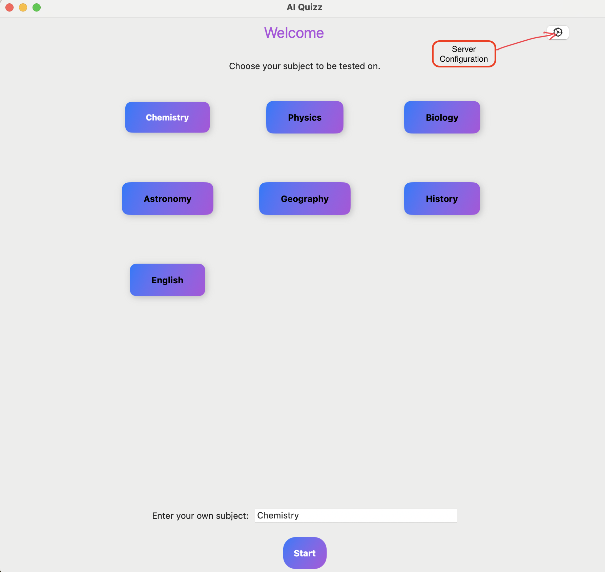
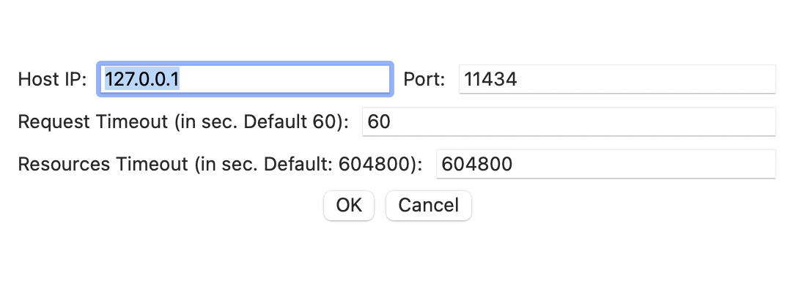

⭐ Star us on GitHub — it motivates us a lot!

[](https://x.com/intent/tweet?text=Check%20out%20this%20project%20on%20GitHub:%20https://github.com/richardlamo/AI-Quizz)
[](https://www.facebook.com/sharer/sharer.php?u=https://github.com/richardlamo/AI-Quizz)
[](https://www.linkedin.com/sharing/share-offsite/?url=https://github.com/richardlamo/AI-Quizz)
[](https://www.reddit.com/submit?title=Check%20out%20this%20project%20on%20GitHub:%20https://github.com/richardlamo/AI-Quizz)
[](https://t.me/share/url?url=https://github.com/richardlamo/AI-Quizz&text=Check%20out%20this%20project%20on%20GitHub)

# AI Quizz

**This generates a simple multiple choice quizz on any subject matter. The target is for primary/elementary students but anyone may use it.**
**This project uses the power of Generative AI. It has been designed and tested using the Llama v3.0 LLM running under Ollama on MacOS.**
**However, as with all generative AI and LLM, there may be some inaccuracies. Please use with that in mind.**

**I created this project to simplify to allow anyone to further their knowledge on any subject matter. Of course one may use any LLM directly. This hopefully allows one to focus on a certain subject matter.**
**The benefit of this approach is that Ollama runs Llama 3 on device. This means that no server requests are made over the web and no need for AI subscription costs.**
**It's not perfect as it's limited by the accuracy of the LLM used. It's an ongoing project and will be improved as better LLMs come along.**
**All kind constructive comments are welcome.**


## Table of Contents
* Installation
* Usage
* Contributing
* License

## Installation
**Instructions on how to install and set up the project.**

* **Prerequisites:** [Ollama](https://ollama.com/download), macOS, xcode (Ver 15 or later)
* **Steps:** 
  * Step 1: Install [Ollama](https://ollama.com/download).
  * Step 2: Install [llama 3](https://ollama.com/blog/llama3). Please consult Ollama documentation to make sure Ollama and llama 3 is working properly.
  * Step 3: Build and run the AI Quizz project in xcode. Once you start the app, the following home page appears.
  
  

  **Make sure the configuration of your Ollama server configuration matches that of your Quizz app. This can be done by selecting the Server configuration in the home page image above. And brings up the dialog below.**

  

  **Make sure the settings matches that used by Ollama (By default Ollama uses port 11434). Once your server settings match, you are ready to play.**

## Usage

Instead of me giving step by step details on how to use this. Here's a little video to show how to use it. Click the image below.

<video src="https://youtu.be/2e4f1W8ybdE?si=a6Fs52DkeaVf3yDY"/>
[Watch the video](https://youtu.be/2e4f1W8ybdE?si=a6Fs52DkeaVf3yDY)

## License
Distributed under the MIT License. See `LICENSE.txt` for more information.


## Contact
For new features or feedback contact me on [GitHub](https://www.linkedin.com/in/richard-lam-64a0a81/) or [Email me](mailto:richardlamo@gmail.com)


## Enjoying my work? Buy me a coffee! ☕️

[](https://buymeacoffee.com/richardlamo)

All contributions are appreciated. It all helps me by bettering the world through improving education for everyone.


<p align="right">(<a href="#readme-top">back to top</a>)</p>


<!--  

## Usage
**Explain how to use the project.**


* **Basic usage:** Provide simple examples. 
* **Advanced usage:** Describe more complex use cases.
* **API reference:** Link to API documentation if applicable.


## Additional Sections (optional)  
* **Features:** Highlight key features of the project.
* **Screenshots:** Include visual examples of the project.
* **Roadmap:** Outline future plans or development goals.
* **Acknowledgements:** Credit contributors or external resources.
* **Contact:** Provide contact information for support or inquiries.


### Example:

```markdown
# My Awesome Project

A brief description of my project.

## Installation
bash
git clone https://github.com/yourusername/yourproject.git
cd yourproject
npm install
```

-->
